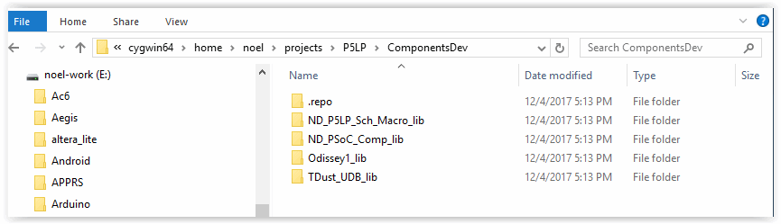
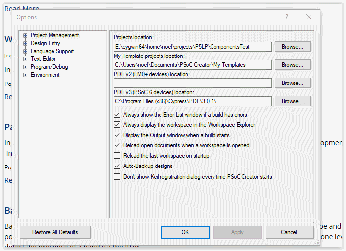
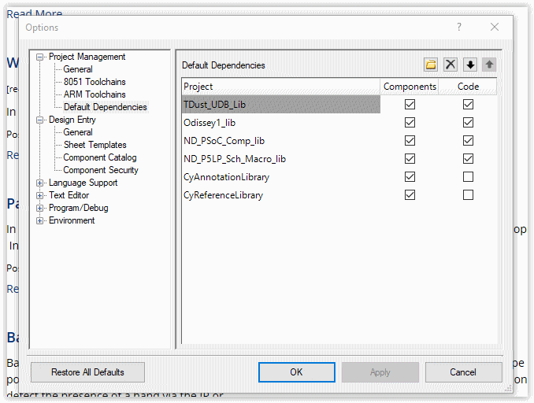
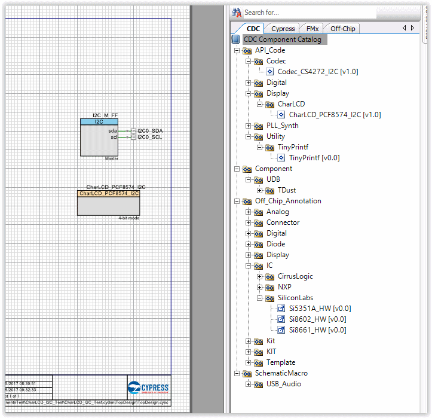

# P5LP_Development_repo
~~~~~~~~~~~~~

* P5LP_Development_repo* holds the default Google repo manifest
* It enables Google's "repo" to manage a number of *PSoC 5LP* Component Library and +
 Test Projects repositories. +
* If you are unfamiliar with repo, you can read up on it
https://code.google.com/archive/p/git-repo/[here].

* The *PSoC_5LP Component Library* + 
 repositories catered for are as follows +

 https://github.com/noeldiviney/ND_PSoC_Comp_lib 

 https://github.com/noeldiviney/ND_P5LP_Sch_Macro_lib

 https://github.com/noeldiviney/ND_P5LP_Arduino_lib

 https://github.com/noeldiviney/Odissey1_lib

 https://github.com/noeldiviney/TDust_UDB_lib  

* Credits go to the following contributers who's work I have borrowed on +
 to create the Library. They have also been a great inspiration in getting +
 my knowledge up to that required to create the Library. Thanks guys.

1.  Michael Bey .... .. CharLCD I2C lib
2.  odissey1 ... ... .... QuadDecoder, DDS24, DDS32, and KIT-059 
3.  Todd Dust .. ... ... TDust_UDB components
4.  Alan Hawse  ... .... Iot_Expert articles and Blogs

TODO ... more components

# I am using Cygwin64 for my Git/Repo working environment
## Sadly!! we have to use Windows 10 for PSoC Creator

http://www.mcclean-cooper.com/valentino/cygwin_install/[Cygwin install
howto]

I also installed apt-cyg (cygwin apt-get) and gem. +
For editing markdown and asciidoc files I istalled
https://github.com/asciidocfx/AsciidocFX/releases/download/v1.5.6/AsciidocFX_Windows.exe[AsciidocFX] +
Add other files as required

# Download and Install Google's repo utility

....
$: mkdir ~/bin
$: curl http://commondatastorage.googleapis.com/git-repo-downloads/repo > ~/bin/repo
$: chmod a+x ~/bin/repo 
....

Edit ~/.bash_profile and uncomment lines 32, 33 and 34 to add ~/bin to
PATH

# Create the PSoC_5LP directory

....
$: mkdir -p ~/projects/P5LP
$: cd projects/P5LP
....

# Configure git with your real name and email address.

....
$: git config --global user.name "Your Name"
$: git config --global user.email "you@example.com"
....

# Initialise the repositories for PSoC_5LP Components

....
$: repo init -u https://github.com/noeldiviney/P5LP_Development_repo
....

# Download the PSoC_5LP Component Libraries

....
$: repo sync
....

once this has completed you should have PSoC_5LP Component Libraries in
place

# Configure PSoC Creator to add the CDC Component libraries

* Launch PSoC Creator
* Do not Load or Create any project yet so that CDC Library is installed for all Projects
* select "Tools->Options"
* Setup the "Options"  dialog as per the following image

* Ensure that "Projects Location" shows ~\projects\P5LP\ComponentsTest"
* Now select "Project Management->Default Dependencies"
* Navigate to "~\projects\P5LP\ComponentsDev"
* Use the "New Entry" button to find and "open" each Libratiy's .cyprj file

## When finished the "Project Management->Default Dependencies" dialog should look like the following

* When finished press "Ok" to close the dialog

# Create "Empty Schematic" project

* Use "File->New->Project" to launch the "Create Project" dialog
* Select "Target device"
* Select "PSoC 5LP" and "CY8C5888LTQ-LP097"   and  "next" btn
* Select "Empty Schematic" and "next" btn
* Select "Finish" btn to launch the new project
* In "Project Explorer" Window double click on the "TopDesign.cysch"
* In the "Component Catalog" window on the right select "CDC" tab

## The "Component Catalog" tree should look like

# Editing the Components in ~projects/P5LP/ComponentsDev

After using "Repo sync" to fetch all the librarys
"Git status" shows that they are detached which means they are unsuitable for git add, git commit etc
To get around this it is necessary to use the following  Git commands.

....
$: git checkout master   or whatever branch one wishes to use
$: git commit -a
$: git push https://github.com/noeldiviney/CharLCD_I2C_Test.git  (in my case)
....

# TODO this is a "Work in progress"
# My intention is to document all of this more thoroughly using GitHub Wiki
